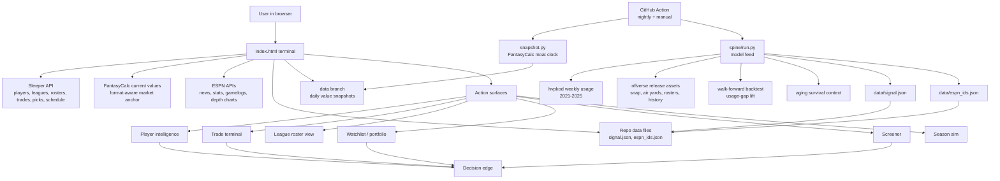
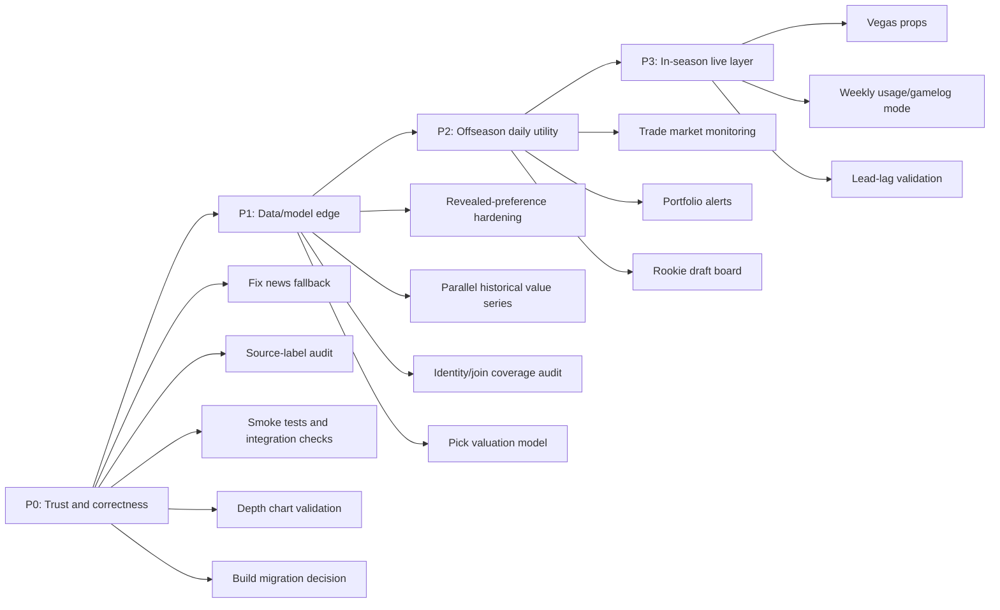

# DWR Project Outline

This is the working product and technical map for DWR / Dynasty Terminal. It is meant to answer four questions:

1. What do we have right now?
2. Where is the project weakest?
3. What should be roadmapped next?
4. What order should the work happen in?

---

## Current State

DWR is a browser-based dynasty fantasy football terminal: one deployable `index.html`, a Python spine that emits modeled data, and a GitHub Action that keeps the data moving.

The important distinction: DWR should not become a prettier API mirror. The long-term edge is the loop between live league data, self-collected value history, backtested usage signals, revealed-preference trade values, and actionable roster/trade surfaces.

### What exists now

Frontend:
- Single-file React/Babel app in `index.html`.
- Player search over Sleeper's live NFL player universe.
- Player pages with value, usage, market, comps, news, stat history, and game logs.
- ESPN depth charts as primary source, matched back to Sleeper players via ESPN ids and `data/espn_ids.json`.
- League sync by Sleeper username, with saved league state and clickable rosters.
- Trade terminal with market/revealed basis, buy-low suggestions, roster needs, pick derivation, and verdict logic.
- Watchlist / portfolio board over tracked players.
- Screener / mispricing board.
- Season sim over synced league schedule.
- Mode badge from Sleeper NFL state.

Spine:
- Weekly usage pull for 2021-2025.
- Opportunity z-scores and usage-gap signal.
- Walk-forward backtest with no future leakage.
- `signal.json` feed with about 1,924 players.
- Snap share display coverage for about 786 players.
- Air-yards display coverage for about 491 players.
- Nearest-neighbor comps.
- Kaplan-Meier aging context from a deeper 2010-2025 nflverse history.
- ESPN id fallback map with about 2,330 position/name keys.
- FantasyCalc value snapshots on the orphan `data` branch.

Action / deploy:
- Nightly spine workflow plus manual dispatch.
- `data/signal.json` and `data/espn_ids.json` committed to `main`.
- Value snapshots appended to the orphan `data` branch so local work cannot clobber the moat clock.

---

## Visual Outline

---

## Weakest Points

These are ordered by how much they affect trust, differentiation, and daily usefulness.

### 1. Source truth and labeling are not tight enough

The app mixes FantasyCalc, Sleeper, ESPN, nflverse, and self-computed values. That is fine, but the user needs to know exactly what each number means.

Highest-risk example: some UI copy still treats FantasyCalc as if it were the DWR value engine, while the project thesis says FantasyCalc is a market anchor / placeholder until revealed preference and intrinsic modeling mature. This is not just copy polish; it is product integrity.

Roadmap:
- Audit every value label and guide entry.
- Use consistent terms: `market`, `intrinsic v0`, `revealed`, `usage signal`, `source unavailable`.
- Never label FantasyCalc as DWR's own value.
- Add source badges where data can silently degrade: ESPN depth, nflverse snap/air-yards, FantasyCalc values, signal feed.

### 2. The differentiated value engine exists, but is not yet the default engine

The revealed-preference solver exists in both Python and browser form. It can solve a synced league's completed trades. That is the right differentiator, but it is still beta UX and not yet persisted, validated across real leagues, or central to the player/screener surface.

Roadmap:
- Live-verify on multiple real Sleeper leagues.
- Show coverage: number of trades, players solved, players still market-anchored.
- Persist solved league values in localStorage per league/season.
- Expose revealed-vs-market deltas in player pages and screener.
- Eventually move a robust solve to the Action for opted-in league ids or user-provided browser runs.

### 3. Integration contracts are brittle

The app is currently buildless, which has been good for deployment speed, but it should be treated as a phase, not a principle. Many live integrations happen directly in the browser. ESPN, Sleeper, FantasyCalc, GitHub branch reads, and localStorage all have slightly different failure modes, and a single `index.html` makes those contracts harder to test.

Roadmap:
- Add a small integration-status panel in the guide or footer.
- Add smoke tests for:
  - `data/signal.json` loads and contains players.
  - `data/espn_ids.json` loads.
  - ESPN depth chart for several teams resolves names.
  - Player stats and gamelogs parse.
  - News does not show unrelated articles as player news.
- Add a repeatable validation script around the extracted Babel block and data-shape checks immediately.
- Migrate to a lightweight build when the validation harness starts fighting the single-file model.

### 4. News is currently a trust problem

The news panel still falls back to unrelated league headlines when no matched player news exists. That makes the terminal feel less precise at the exact moment precision matters.

Roadmap:
- Fix empty state first.
- Move general headlines into a clearly labeled global wire.
- Build Action-side `data/news.json` if browser CORS blocks better sources.
- Add sources gradually: ESPN, NFL.com, CBS/Yahoo/NBC where reachable, team sites, then beat reporter feeds if legally and technically workable.

### 5. Identity joins are the hidden model risk

Most interesting data depends on joining across providers. The project already had to add `data/espn_ids.json` because Sleeper lacks ESPN ids for smaller players. nflverse snap/air-yards coverage is useful but incomplete.

Current artifact coverage:
- `signal.json`: about 1,924 players.
- Snap share emitted for about 786 players.
- Air-yards emitted for about 491 players.
- ESPN id fallback map: about 2,330 position/name keys.

Roadmap:
- Add a coverage report artifact from the Action.
- Track coverage by season, position, and source.
- Prefer id joins where possible; keep name joins explicit and auditable.
- Do not fold snap/air-yards into opportunity until out-of-sample lift improves after coverage fixes.

### 6. The frontend has outgrown one mental page

The single-file deployment model is fine. The weakness is not "single file" by itself; it is that product surfaces, data access, modeling helpers, UI components, and copy all live together without strong section boundaries or tests.

Roadmap:
- Keep no-build deployment only as long as it helps speed more than it hurts correctness.
- Organize `index.html` into clear sections with stronger comments:
  - data clients
  - source/index helpers
  - player surfaces
  - league/trade/sim surfaces
  - guide/copy
- Add a validation script now.
- Start a staged migration plan toward Vite + React modules:
  - `src/data/` for API clients and source adapters.
  - `src/model/` for value, trade, signal, pick, and join helpers.
  - `src/components/` for reusable UI pieces.
  - `src/surfaces/` for player, league, trade, screener, watchlist, sim, and guide views.
  - `public/data/` or copied `data/` artifacts for Pages deploy.
- Use GitHub Pages from a built `dist/` once the split happens.

Migration triggers:
- Adding automated browser tests.
- Adding more Action-generated artifacts such as news, coverage reports, or historical value series.
- Reusing components across multiple surfaces becomes painful.
- Source-contract bugs become more expensive than build complexity.
- The portfolio needs to demonstrate production engineering, not only clever single-file hacking.

Recommended path: do not pause product work for a framework migration immediately. First add the validation harness and source-label cleanup. Then migrate to Vite before the next major surface build, especially before news aggregation, portfolio alerts, or a richer offseason/in-season mode switch.

### 7. Offseason mode is not yet a first-class product

The mode badge ships, and many offseason-useful tools exist. But the app still mostly behaves like one generic terminal. In the offseason, the daily jobs are different: trades, rookie draft, portfolio, value movement, league construction.

Roadmap:
- Offseason default: watchlist, screener, trade market, picks, league portfolio.
- In-season default: usage, game logs, weekly movement, injuries/news, Vegas props.
- Do not wait for fall to design the switch; only wait for fall to validate live in-season signals.

### 8. Pick values are still too approximate

Pick auto-derivation is useful. Format-scaling exists. But dynasty pick valuation needs league context: class strength, round, year, team finish probability, superflex premium, and rookie tier cliffs.

Roadmap:
- Add pick provenance and confidence.
- Tie pick value to projected finish / sim outcomes.
- Add rookie draft board and class tiers.
- Eventually learn pick discounts from revealed trades.

### 9. The portfolio moat is visible, but not yet active

Watchlists show tracked players and value movement. That is the first view where the value time-series becomes personal. It still needs alerts and explanations.

Roadmap:
- Add watchlist event cards: value up/down, new buy flag, depth change, news match, usage change.
- Show "why changed" rather than only "changed".
- Add export/shareable portfolio snapshot for portfolio-piece storytelling.

---

## Prioritized Roadmap

### P0: Trust and correctness

Goal: make every displayed number/source defensible.

1. Fix player news fallback.
   - No random articles in player panels.
   - Add separate global news wire.

2. Source-label audit.
   - Clean up FantasyCalc/DWR/revealed/intrinsic copy.
   - Add source labels to value, depth, stats, news, and usage panels.

3. Validation harness.
   - Extract Babel block and transpile.
   - Validate `signal.json`, `espn_ids.json`, and core data shapes.
   - Add a small set of ESPN/Sleeper smoke checks that can run manually or in CI where network allows.

4. Build migration decision.
   - Keep no-build only while it is cheaper than a build step.
   - Define the Vite migration boundary before the next major surface build.
   - Preserve GitHub Pages deploy via built static assets.

5. ESPN depth hardening.
   - Validate all 32 team mappings.
   - Make WR slot/rank structure clearer.
   - Show partial-source status when ESPN has unmapped athletes.

### P1: Actual edge

Goal: move from "terminal with signals" to "terminal with a defensible proprietary value read."

1. Revealed-preference hardening.
   - Multi-league verification.
   - Coverage/confidence metrics.
   - Persist solved values per synced league.
   - Add revealed deltas to player/screener surfaces.

2. Historical value series decision.
   - Build a parallel DynastyProcess/FantasyPros-derived series, labeled separately, or explicitly stay FantasyCalc-forward-only.
   - Recommendation: build the parallel series for visuals and historical context, but do not pretend it is FantasyCalc backfill.

3. Identity coverage audit.
   - Action artifact: join coverage by source/season/position.
   - Fix the highest-value join gaps first.

4. Pick valuation model.
   - Add league finish probability and class-year context.
   - Let revealed trades start informing pick discounts once enough trades exist.

### P2: Offseason daily utility

Goal: make DWR worth opening when games are not being played.

1. Portfolio alerts.
   - Watchlist deltas, buy/sell flags, depth moves, news matches.

2. Trade market monitor.
   - Surface players whose market/intrinsic/revealed values diverge.
   - Show who rosters them and why they fit your team.

3. Rookie and pick center.
   - Rookie draft board.
   - Pick values by league format, class year, and projected finish.

4. League construction view.
   - Positional portfolio, age curve exposure, contender/rebuild fit, pick runway.

### P3: In-season layer

Goal: use live weekly data to validate and act on the lead-lag thesis.

1. Weekly usage mode.
   - Gamelogs, snaps/routes/targets, role changes, injury context.

2. Vegas prop-implied points.
   - De-vig props and compare to market/intrinsic.
   - Defer until lines are live and stable.

3. Lead-lag validation.
   - Track whether usage moves precede value movement during the season.
   - Report results honestly, even if the signal weakens.

---

## Suggested Next Sprint

If the goal is maximum improvement per hour, do this next:

1. Fix news fallback and global news separation.
2. Do the source-label audit, especially FantasyCalc vs DWR/revealed/intrinsic wording.
3. Add a small validation script for data shape + Babel syntax.
4. Decide and document the Vite migration boundary.
5. Validate ESPN depth mappings for all 32 teams and improve WR slot display.
6. Add revealed-value coverage/confidence to the trade terminal.

That sprint improves trust first, then sharpens the differentiated value story. It is less flashy than adding another tab, but it makes the terminal feel much more real.
